# Lab3Web
## Praktikum 3: PHP dan Database MySQL
## Membuat aplikasi CRUD sederhana.


### Instruksi Praktikum
1. Persiapkan text editor misalnya VSCode.
2. Buat folder baru dengan nama lab3_php_database pada docroot webserver (htdocs)
3. Ikuti langkah-langkah praktikum yang akan dijelaskan berikutnya.


### Langkah-langkah Praktikum

#### Persiapan

Untuk memulai membuat aplikasi CRUD sederhana, siapkan database server menggunakan MySQL. Pastikan MySQL server sudah dapat dijalankan melalui XAMPP.


#### Menjalankan MySQL Server
Untuk menjalankan MySQL server dari menu XAMPP Control.


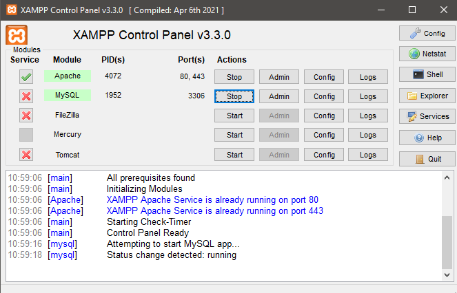


#### Mengakses MySQL Client menggunakan PHP MyAdmin
Pastikan webserver Apache dan MySQL server dijalankan. Kemudian buka melalui browser:

http://localhost/phpmyadmin/


#### Membuat Database: Studi Kasus Data Barang 

1. Membuat Database dengan nama database ``latihan1``.

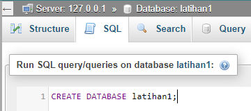

2. Membuat tabel di dalam database ``latihan1`` dengan nama ``data_barang``.

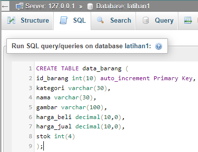

3. Menambahkan data tabel ``data_barang``.

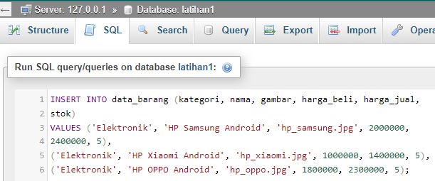

#### Membuat Program CRUD
Buat folder lab3_php_database pada root directory web server (c:\xampp\htdocs)

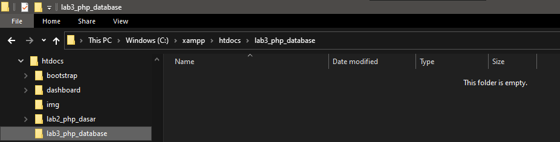

Kemudian untuk mengakses direktory tersebut pada web server dengan mengakses URL:
http://localhost/lab3_php_database/

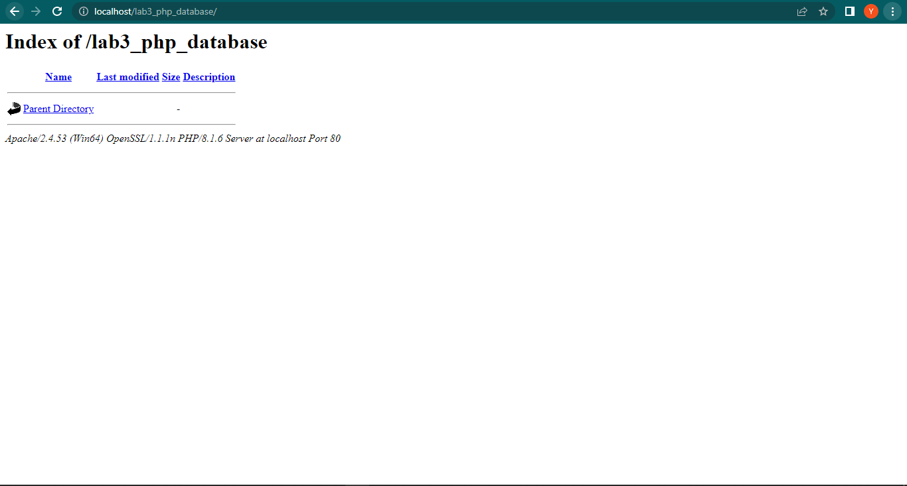

#### Membuat File Koneksi Database

1. Buat file baru dengan nama ``koneksi.php``, lalu simpan ke dalam folder ``lab3_php_database``.
2. Kemudian ketikkan kode berikut :

    ```php
    <?php
    $host = "localhost";
    $user = "root";
    $pass = "";
    $db = "latihan1";

    $conn = mysqli_connect($host, $user, $pass, $db);
    if ($conn == false)
    {
    echo "Koneksi ke server gagal.";
    die();
    } else #echo "Koneksi berhasil";
    ?>
    ```

3. Buka melalui browser untuk menguji koneksi database (untuk menyampaikan pesan koneksi berhasil, ``_uncomment_`` pada perintah ``echo "koneksi berhasil"``). Maka tampilannya akan seperti berikut ini :

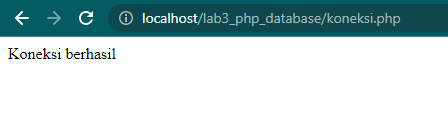


### B. Membuat File Index Untuk Menampilkan Data (Read)

1. Buat file baru dengan nama ``index.php``, lalu simpan ke dalam folder ``lab3_php_database``.
2. Kemudian ketikkan kode berikut :

```php
    <?php
// memanggil koneksi database
require_once("koneksi.php");

// query untuk menampilkan data barang
$sql = "SELECT * FROM data_barang";
$result = mysqli_query($conn, $sql);

$no = 1;
?>

<!DOCTYPE html>
<html>

<head>
    <title>Data Barang</title>
    <link rel="stylesheet" href="https://cdn.jsdelivr.net/npm/bootstrap@5.2.0-beta1/dist/css/bootstrap.min.css" />
</head>

<body>
    <h1 class="py-2 px-3 text-center" style="background-color: #1E90FF; color: white;">Data Barang</h1>

    <div class="container">
        <div class="mt-4">
            <a href="tambah.php" class="btn btn-success btn-sm mb-4 float-end">Tambah Barang</a>
            <table class="table table-sm table-bordered">
                <tr class="text-center fw-bold text-uppercase">
                    <th>No</th>
                    <th>Gambar</th>
                    <th>Nama</th>
                    <th>Kategori</th>
                    <th>Harga Beli</th>
                    <th>Harga Jual</th>
                    <th>Stok</th>
                    <th>Aksi</th>
                </tr>
                <?php while ($row = mysqli_fetch_assoc($result)) { ?>
                    <tr>
                        <td class="text-center"><?php echo $no;
                                                $no++ ?></td>
                        <td class="text-center">" alt="<?= $row['nama']; ?>" width="100px" /></td>
                        <td><?php echo $row['nama']; ?></td>
                        <td><?php echo $row['kategori']; ?></td>
                        <td>Rp. <?php echo $row['harga_beli']; ?></td>
                        <td>Rp. <?php echo $row['harga_jual']; ?></td>
                        <td><?php echo $row['stok']; ?></td>
                        <td class="text-center">
                            <a href="ubah.php?id=<?php echo $row['id_barang']; ?>" class="btn btn-warning btn-sm mx-1">Edit</a>
                            <a href="hapus.php?id=<?php echo $row['id_barang']; ?>" class="btn btn-danger btn-sm mx-1" onclick="return confirm('Apakah Anda yakin ingin menghapus barang ini?')">Hapus</a>
                        </td>
                    </tr>
                <?php } ?>
            </table>
        </div>
    </div>
</body>

</html>
```

3. Tampilannya akan seperti berikut :

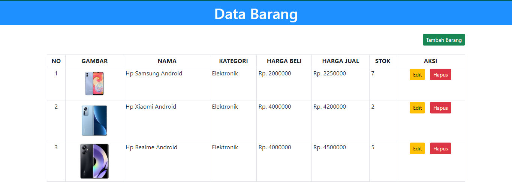


### C. Menambah Data (Create)

1. Buat file baru dengan nama ``tambah.php``, lalu simpan ke dalam folder ``lab3_php_database``.
2. Kemudian ketikkan kode berikut :

```php
    <?php
error_reporting(E_ALL);
include_once 'koneksi.php';
if (isset($_POST['submit'])) {
    $input = (object) $_POST;

    $nama = ucwords(strtolower($input->nama));
    $kategori = ucwords(strtolower($input->kategori));
    $harga_beli = $input->harga_beli;
    $harga_jual = $input->harga_jual;
    $stok = $input->stok;
    $file_gambar = $_FILES['file_gambar'];
    $gambar = NULL;

    if ($file_gambar['error'] == 0) {
        $nama_gambar = str_replace(' ', '_', $file_gambar['name']);
        $path = dirname(__FILE__) . '/gambar/' . $nama_gambar;

        if (move_uploaded_file($file_gambar['tmp_name'], $path)) {
            $gambar = $nama_gambar;
        }
    }

    $sql = 'INSERT INTO data_barang (nama, kategori,harga_jual, harga_beli,
stok, gambar) ';
    $sql .= "VALUE ('{$nama}', '{$kategori}','{$harga_jual}',
'{$harga_beli}', '{$stok}', '{$gambar}')";
    $result = mysqli_query($conn, $sql);
    header('location: index.php');
}
?>
<!DOCTYPE html>
<html lang="en">

<head>
    <meta charset="UTF-8">
    <link href="style.css" rel="stylesheet" type="text/css" />
    <title>Tambah Barang</title>
    <link rel="stylesheet" href="https://cdn.jsdelivr.net/npm/bootstrap@5.2.0-beta1/dist/css/bootstrap.min.css" />
</head>

<body>
    <div class="container">
        <div class="row m-0">
            <div class="col-md-5 mx-auto">
                <div class="card mt-3">
                    <div class="card-header text-center">
                        <h1>Tambah Barang</h1>
                    </div>
                    <div class="card-body">
                        <form method="post" action="tambah.php" enctype="multipart/form-data">
                            <div class="mb-3">
                                <label>Nama Barang</label>
                                <input type="text" name="nama" />
                            </div>
                            <div class="mb-3">
                                <label>Kategori</label>
                                <select name="kategori">
                                    <option value="Komputer">Komputer</option>
                                    <option value="Elektronik">Elektronik</option>
                                    <option value="Hand Phone">Hand Phone</option>
                                </select>
                            </div>
                            <div class="mb-3">
                                <label>Harga Jual</label>
                                <input type="text" name="harga_jual" />
                            </div>
                            <div class="mb-3">
                                <label>Harga Beli</label>
                                <input type="text" name="harga_beli" />
                            </div>
                            <div class="mb-3">
                                <label>Stok</label>
                                <input type="text" name="stok" />
                            </div>
                            <div class="mb-3">
                                <label>File Gambar</label>
                                <input type="file" name="file_gambar" />
                            </div>
                            <a href="index.php" class="btn btn-secondary">Kembali</a>
                            <button class="btn btn-success" name="submit" type="submit">
                                Tambah
                            </button>
                        </form>
                    </div>
                </div>
            </div>
        </div>
    </div>
    </div>
</body>

</html>
```

3. Tampilannya akan seperti berikut :

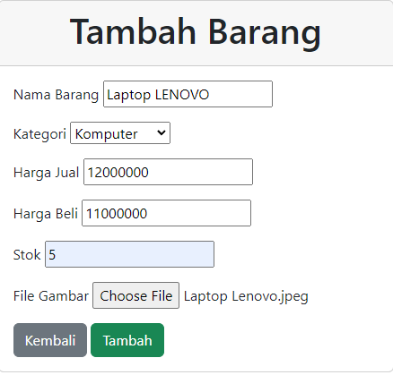

* Tampilan setelah data ditambahkan :

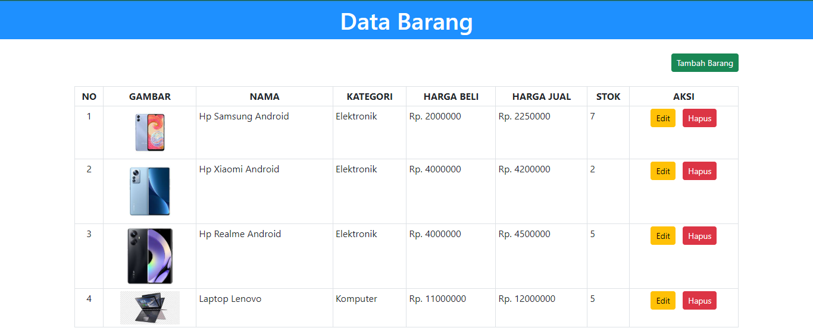


### D. Mengubah Data (Update)

1. Buat file baru dengan nama ``ubah.php``, lalu simpan ke dalam folder ``lab3_php_database``.
2. Kemudian ketikkan kode berikut :

```php
    <?php
error_reporting(E_ALL);
include_once 'koneksi.php';
if (isset($_POST['submit'])) {
    $id = $_POST['id'];
    $nama = $_POST['nama'];
    $kategori = $_POST['kategori'];
    $harga_jual = $_POST['harga_jual'];
    $harga_beli = $_POST['harga_beli'];
    $stok = $_POST['stok'];
    $file_gambar = $_FILES['file_gambar'];
    $gambar = null;
    if ($file_gambar['error'] == 0) {
        $filename = str_replace(' ', '_', $file_gambar['name']);
        $destination = dirname(__FILE__) . '/gambar/' . $filename;
        if (move_uploaded_file($file_gambar['tmp_name'], $destination)) {
            $gambar = 'gambar/' . $filename;;
        }
    }
    $sql = 'UPDATE data_barang SET ';
    $sql .= "nama = '{$nama}', kategori = '{$kategori}', ";
    $sql .= "harga_jual = '{$harga_jual}', harga_beli = '{$harga_beli}',
stok = '{$stok}' ";
    if (!empty($gambar))
        $sql .= ", gambar = '{$gambar}' ";
    $sql .= "WHERE id_barang = '{$id}'";
    $result = mysqli_query($conn, $sql);
    header('location: index.php');
}
$id = $_GET['id'];
$sql = "SELECT * FROM data_barang WHERE id_barang = '{$id}'";
$result = mysqli_query($conn, $sql);
if (!$result) die('Error: Data tidak tersedia');
$data = mysqli_fetch_array($result);
function is_select($var, $val)
{
    if ($var == $val) return 'selected="selected"';
    return false;
}
?>
<!DOCTYPE html>
<html lang="en">

<head>
    <meta charset="UTF-8">
    <link href="style.css" rel="stylesheet" type="text/css" />
    <title>Ubah Barang</title>

    <link rel="stylesheet" href="https://cdn.jsdelivr.net/npm/bootstrap@5.2.0-beta1/dist/css/bootstrap.min.css" />
</head>

<body>
    <div class="container">
        <h1>Ubah Barang</h1>
        <div class="main">

            <form method="post" action="ubah.php" enctype="multipart/form-data">

                <div class="input">
                    <label>Nama Barang</label>
                    <input type="text" name="nama" value="<?php echo
                                                            $data['nama']; ?>" />
                </div>
                <div class="input">
                    <label>Kategori</label>
                    <select name="kategori">
                        <option <?php echo is_select('Komputer', $data['kategori']); ?> value="Komputer">Komputer</option>
                        <option <?php echo is_select('Komputer', $data['kategori']); ?> value="Elektronik">Elektronik</option>
                        <option <?php echo is_select('Komputer', $data['kategori']); ?> value="Hand Phone">Hand Phone</option>
                    </select>
                </div>
                <div class="input">
                    <label>Harga Jual</label>
                    <input type="text" name="harga_jual" value="<?php echo
                                                                $data['harga_jual']; ?>" />
                </div>
                <div class="input">
                    <label>Harga Beli</label>
                    <input type="text" name="harga_beli" value="<?php echo
                                                                $data['harga_beli']; ?>" />
                </div>
                <div class="input">
                    <label>Stok</label>
                    <input type="text" name="stok" value="<?php echo
                                                            $data['stok']; ?>" />
                </div>
                <div class="input">
                    <label>File Gambar</label>
                    <input type="file" name="file_gambar" />
                </div>
                <div class="submit">
                    <input type="hidden" name="id" value="<?php echo
                                                            $data['id_barang']; ?>" />
                </div>
                <a href="index.php" class="btn btn-secondary">Kembali</a>
                <button class="btn btn-warning" name="submit" type="submit">
                    Edit
                </button>
            </form>
        </div>
    </div>
</body>

</html>
```

3. Tampilannya akan seperti berikut :

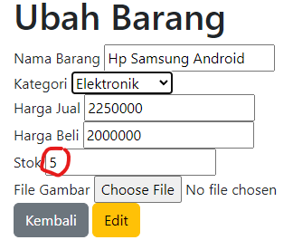

* Tampilan setelah data diubah :

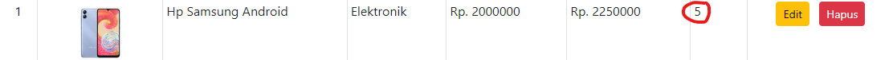


### E. Menghapus Data (Delete)

1. Buat file baru dengan nama ``ubah.php``, lalu simpan ke dalam folder ``lab3_php_database``.
2. Kemudian ketikkan kode berikut :

    ```php
    <?php
    include_once 'koneksi.php';
    $id = $_GET['id'];
    $sql = "DELETE FROM data_barang WHERE id_barang = '{$id}'";
    $result = mysqli_query($conn, $sql);
    header('location: index.php');
    ?>
    ```

3. Tampilannya akan seperti berikut :

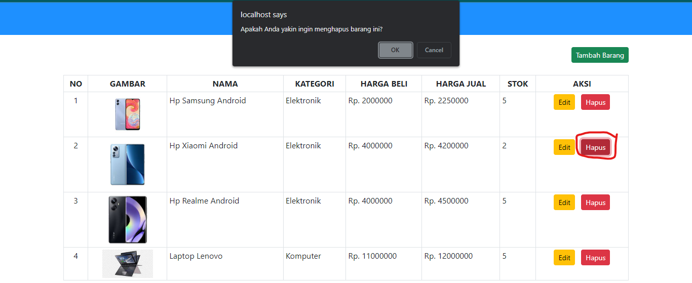

* Tampilan setelah salah satu data tersebut dihapus :


### SEKIAN, TUGAS PRAKTIKUM 3 YANG BERISI PENJELASAN TENTANG MEMBUAT APLIKASI CRUD SEDERHANA DENGAN INSTRUKSI DAN LANGKAH SERTA HASIL DARI PROGRAM TERSEBUT MENGGUNAKAN BAHASA PEMROGRAMAN PHP MELALUI APLIKASI VSCODE, TERIMAKASIH!
